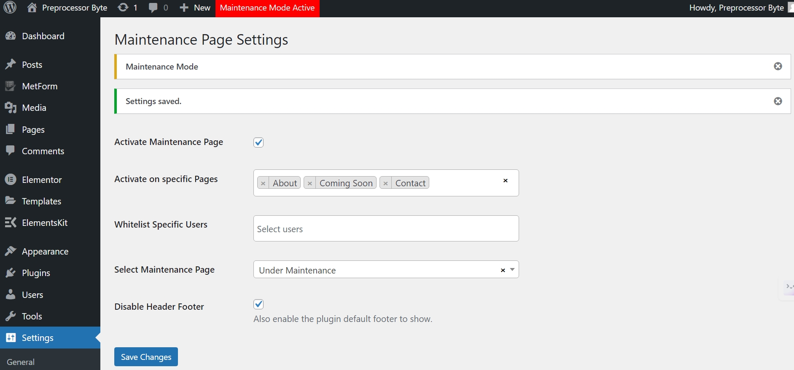
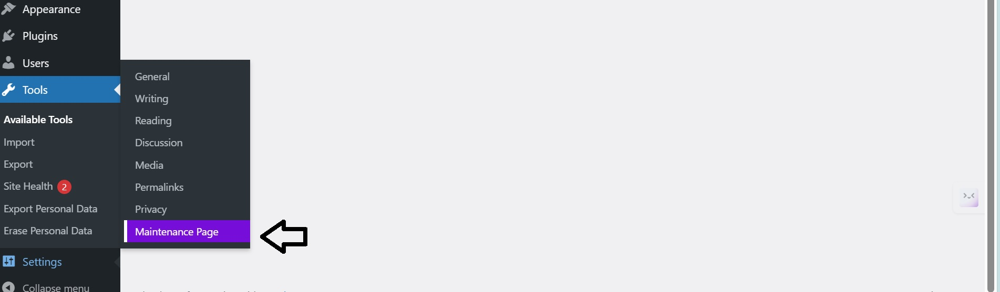
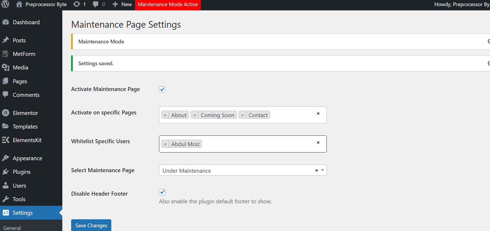
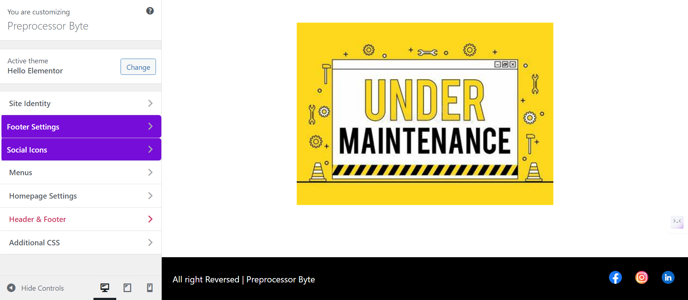
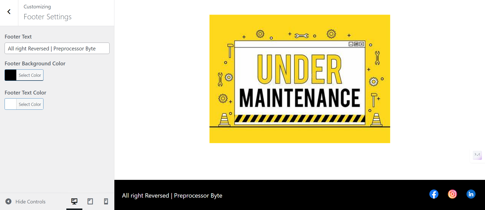

# Coming Soon and Maintenance Mode Plugin



## Table of Contents
- [Introduction](#introduction)
- [Features](#features)
- [Getting Started](#getting-started)
- [Usage](#usage)
- [Customization Options](#customization-options)
- [Contributing](#contributing)
- [Live Demo](#live-demo)

## Introduction
The **Coming Soon and Maintenance Mode Plugin** is a WordPress plugin developed to display a maintenance page on specific pages of your website. It allows you to whitelist users to bypass the maintenance page and has compatibility with maintenance designs created using Elementor. The plugin also includes customization options for adding footers and social icons.

## Features
- Display a maintenance page on selected or all pages
- Whitelist users to bypass the maintenance page
- Compatibility with Elementor-designed maintenance pages
- Customization options for footer and social icons
- Responsive design for both desktop and mobile devices

## Getting Started
### Prerequisites
- A WordPress website

### Installation
1. Download the zip file from the GitHub repository.
   [Link to GitHub Repository](https://github.com/moiz-codebyte/coming-soon-and-maintenance-page-plugin)
2. Upload the plugin files to the `/wp-content/plugins/` directory, or install the plugin through the WordPress plugins screen directly.
   

3. Activate the plugin through the 'Plugins' screen in WordPress.

## Usage
1. Navigate to the **Settings** menu and select **Maintenance Page**.
   
2. Activate the Maintenance page.
   
3. Configure the following options:
   - **Activate on Specific Pages**: Activate the maintenance mode on all pages or specific pages. Multiple selections are possible.
   - **Whitelist Users**: Whitelist users from the list of users present on the website. Multiple selections are also possible.
   - **Maintenance Page**: Select any page as the Maintenance page from the list of pages present on the website or develop one using Elementor.
   - **Disable Header and Footer**: Disable the header and footer on the selected maintenance page.
   

## Customization Options
1. Go to **Appearance** > **Customize**.
2. Plugin options will be marked with purple color.
     

### Footer Section
   

- **Copyright Text**: Customize the copyright text.
- **Text Color**: Change the text color.
- **Footer Background Color**: Change the footer background color.

### Social Icons
   

- Select up to five social icons to display in the footer.
- Note: These footer and social icons only appear when the header and footer of the maintenance page are disabled. This can be managed through the plugin settings.

## Contributing
Contributions are welcome! If you have any ideas, suggestions, or improvements, feel free to create a pull request or open an issue.

### Steps to Contribute
1. Fork the repository.
2. Create a new branch:
   ```bash
   git checkout -b feature/your-feature-name
   ```
3. Make your changes and commit them:
   ```bash
   git commit -m "Add your feature"
   ```
4. Push to the branch:
   ```bash
   git push origin feature/your-feature-name
   ```
5. Open a pull request.

### After Opening a Pull Request
1. **Review**: Address any feedback or change requests made by the reviewers.
2. **Approval**: Wait for the pull request to be approved by the maintainers.
3. **Merge**: Once approved, the pull request will be merged by a maintainer.
4. **Close**: The pull request will be closed upon merging. If not merged, it might be closed manually with an explanation.
5. **Cleanup**: Delete your feature branch after the pull request is merged and update your local repository.

## License
This project is open-source and available under the [MIT License](LICENSE).

## Live Demo
You can download zip and test it out and provide feedback to email. Please report any bug if you find out as we are committed to move it production and make it available for all user in WordPress directory 

For any questions or support, please contact at [hello@abdulmoiz.net](mailto:hello@abdulmoiz.net).

---

This plugin is a product of **Team Preprocessor Byte** and was developed during the **WordSprint Hackathon 3.0**, where our team secured the **2nd position**.
Thank You, iCode Guru, for providing this opportunity to compete with our compatibilities and industry best.

Enjoy maintaining your website with ease!