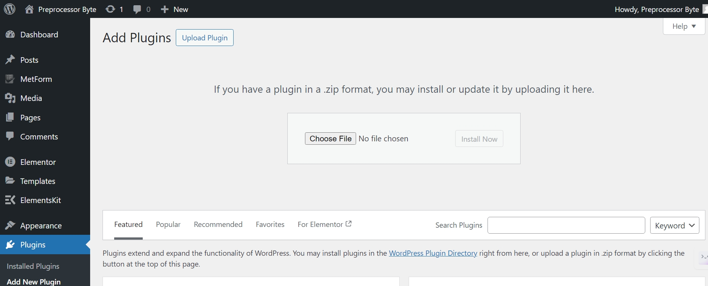
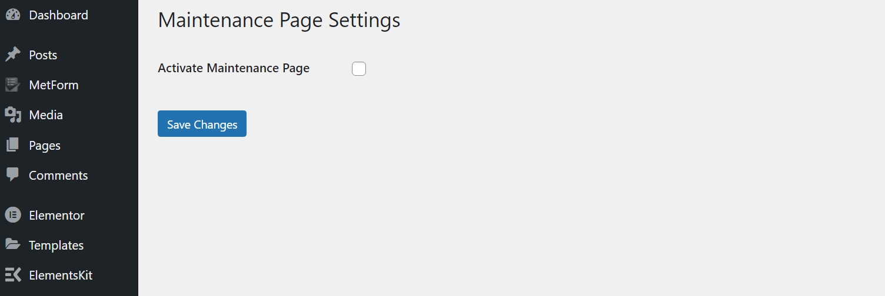
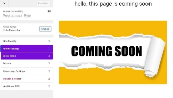
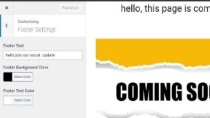
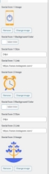
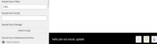

# Coming Soon and Maintenance Mode Plugin

## WordSprint Hackathon 3.0           
Coming Soon and Maintenance Mode Plugin

#### i. Introduction

A plugin developed to show a maintenance page on specific pages. It also whitelists users to not show the maintenance page. It has compatibility with select maintenance designed by Elementor. Add footer and social icons using customize options.

#### ii. Demo

The plugin is tested live on our website [here](http://preprocessor-byte.abdulmoiz.net/wp-admin). 
- Username: hello@abdulmoiz.net
- Password: Ai12345@

#### iii. Source Code

The source can be accessed through the link [here](https://github.com/Moiz-CodeByte/coming-soon-and-maintenance-page-plugin).

#### iv. How to Install the Plugin?

1. Download the zip file from the GitHub repository. [Link here](https://github.com/Moiz-CodeByte/coming-soon-and-maintenance-page-plugin)

2. Upload the plugin.

3. Install and activate the plugin.
4. Hover over Settings and go to the Maintenance Page.

5. Activate the Maintenance page.
6. Then you will see more options.

- **Activate on Specific Pages**: You can also activate on all pages or a single page. Multiple selections are available.
- **Whitelist Users**: You can also whitelist users from the list of users present on the website. Multiple selections are also possible.
- **Maintenance Page**: You can select any page as the Maintenance page from all the list of pages present on the website, or you can develop using **Elementor**.
- **Disable Header and Footer**: You can disable the header and footer on the maintenance page.

#### v. Customize Options

- Go to the Customize option by going to Appearance then Customize.

Here you will find a bunch of plugin and theme options.

The options with our brand color are plugin options.

- **Footer Section**

  The footer setting has an option of copyright text, text color, and footer background color.

- **Social Icons**

These social icons are shown in the footer.

 

Users can select up to five icons to show in the footer.

**Note: This footer and social icons only show when the footer and header of the maintenance page are disabled.**

**This can be disabled by going to our plugin setting.**

Thank You, iCode Guru, for providing this opportunity to compete with our compatibilities and industry best.
